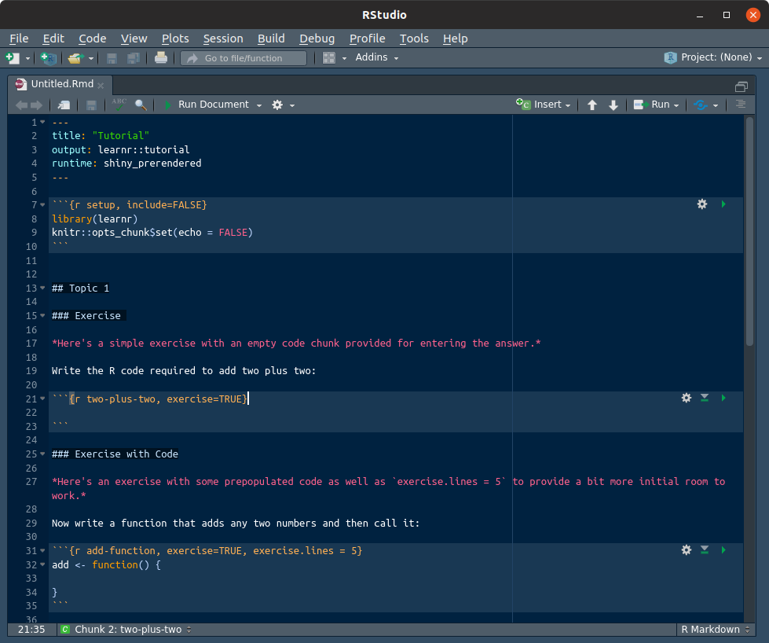
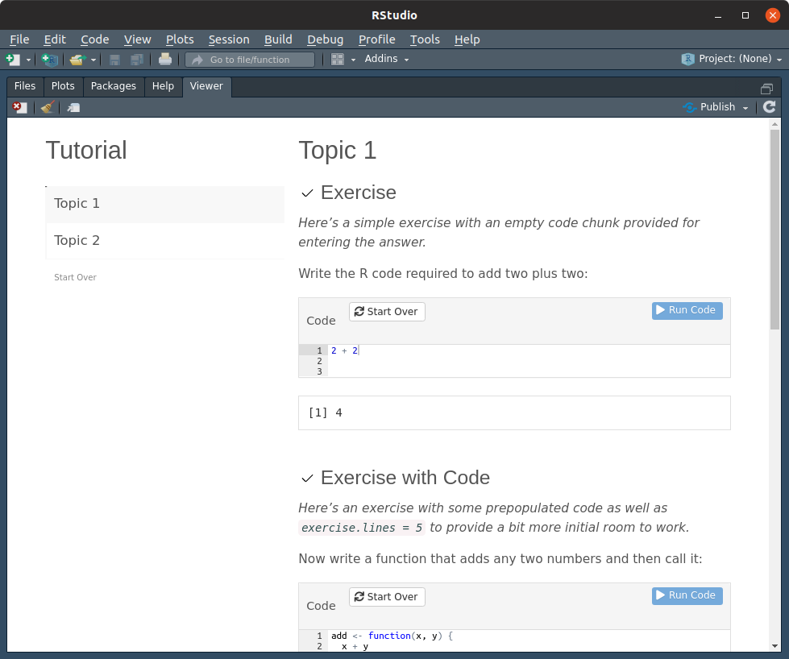

## Learning R

This repository contains a prototype R learning environment, intended to be run via Docker.  It consists of:

* R itself, along with a few packages and other dependencies
* a package containing tutorials written with the `learnr` R Markdown template
* scripts and files to:
    - start each tutorial on a separate port
    - configure nginx to reverse proxy for each
    - provide a basic index page listing each tutorial
* RStudio Server for experimentation.

### Building and Running the Environment

Building the container is straightforward:

```bash
$ docker build -t tutr .
```

To run the container:

```bash
$ docker run -d --rm --name tutr -p 8080:8080 tutr
```

Then, just browse to `http://localhost:8080`.  An instance of RStudio Server will be running at `http://localhost:8080/rstudio` with the username `guest` and password `guest`.






