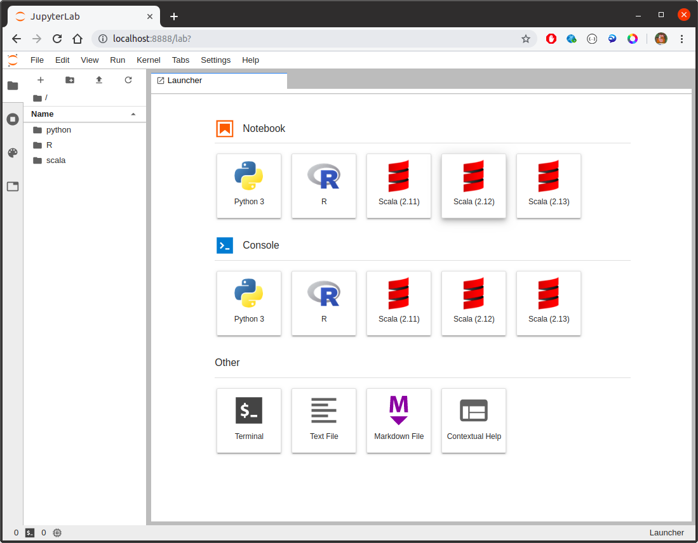
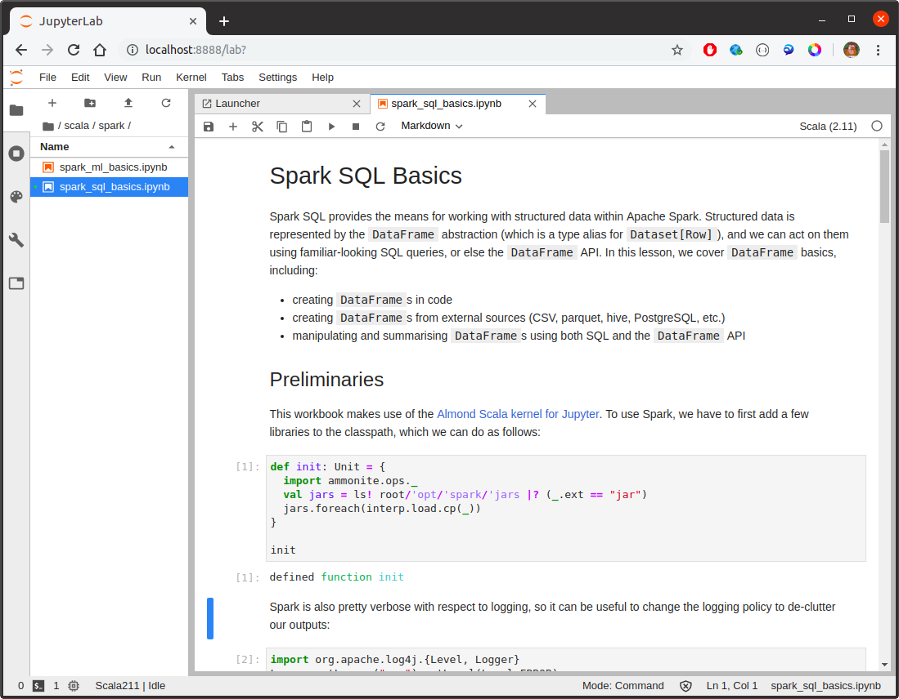

## Learn Apache Spark

This repository contains everything needed to build a single Docker container consisting of:

* Hadoop
* Hive
* Apache Spark
* sbt
* R
* Python 3
* JupyterLab with R, Python, and Scala kernels
* Jupyter notebooks covering a range of topics
* bundled data, including pre-populated Hive tables, CSV files, parquet files, and so on.

The intention is to gradually add to the notebooks over time, and have these the basis for self-directed learning using a typical 'Big Data' environment.  Everything needed to run the environment is included.

### Building and Running the Environment

Build the container as follows:

```bash
$ docker build -t bigdata .
```

To run the container:

```bash
$ docker run -d --rm --name bigdata -p 8888:8888 bigdata
```

Since data is loaded to Hive on startup, it will take a minute for everything to be up and running.  Once it is, simply browse to `http://localhost:8888`.




